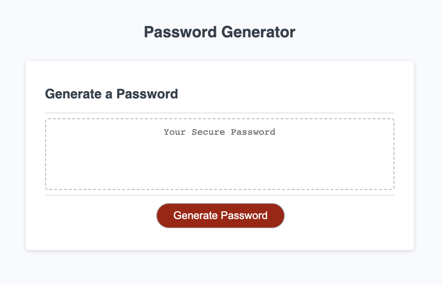
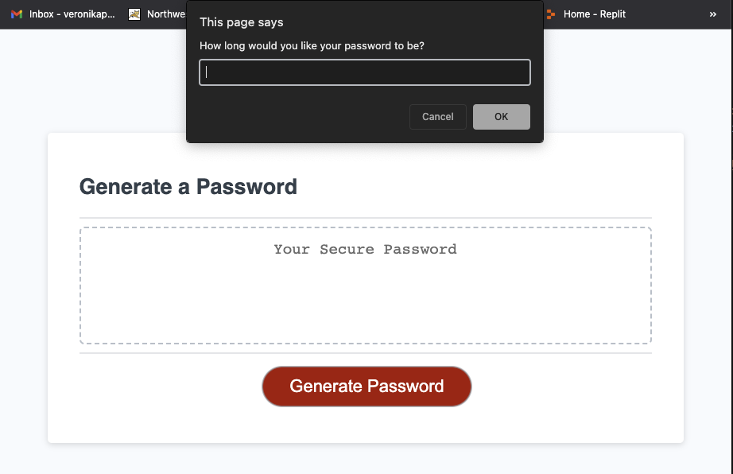

# Secure Password Generator App

## Project Scope

The scope of this project was to create a javascript code to generate a secure and random password for employees who have access to sensitive information.

(<a href="#veronika-pomyateeva-developer-portfolio">back to top</a>)

---

## Functionality 

The following criteria include functionalities required: 

- The application includes a "Generate Password" button
- When the "Generate Password" button is clicked, a user is presented with a series of prompts specifying desired password criteria 
- Prompts specify password length, upper, lower, numeric, and special characters 
- The app validates that the length of the password is between 8 and 128 characters
- The app validates that the user picked at least one of the alphanumeric criteria
- The app generates a password that matches the criteria selected by the user
- A new secure password is displayed on the page

(<a href="#veronika-pomyateeva-developer-portfolio">back to top</a>)

---

## Demo 

This mock-up demonstrates the overall design of the application that a user is presented with.

This mock-up demonstrates the functionality of user prompts using the first prompt for password length as an example.

(<a href="#veronika-pomyateeva-developer-portfolio">back to top</a>)

---

## Application link

[Password Generator](ENTHER PATH TO THE DEPLOYED APP)

(<a href="#veronika-pomyateeva-developer-portfolio">back to top</a>)

---

## License

Distributed under the MIT License. See `LICENSE.txt` for more information.

(<a href="#veronika-pomyateeva-developer-portfolio">back to top</a>)

---

## Acknowledgments 

This list includes resources used for the project. 

- [Best README Template](https://github.com/othneildrew/Best-README-Template/blob/master/README.md)
- [codecademy forum: Math.random and Math.floor explained by Gabrielle Epstein](https://www.codecademy.com/forum_questions/50c386a4a122749bc1006ca6)
- [freeCodeCamp: How the Question Mark (?) Operator Works in JavaScript](https://www.freecodecamp.org/news/how-the-question-mark-works-in-javascript/)
- [flexiple: How to use the JavaScript += operator?](https://flexiple.com/javascript/javascript-plus-equal/)

(<a href="#veronika-pomyateeva-developer-portfolio">back to top</a>)
